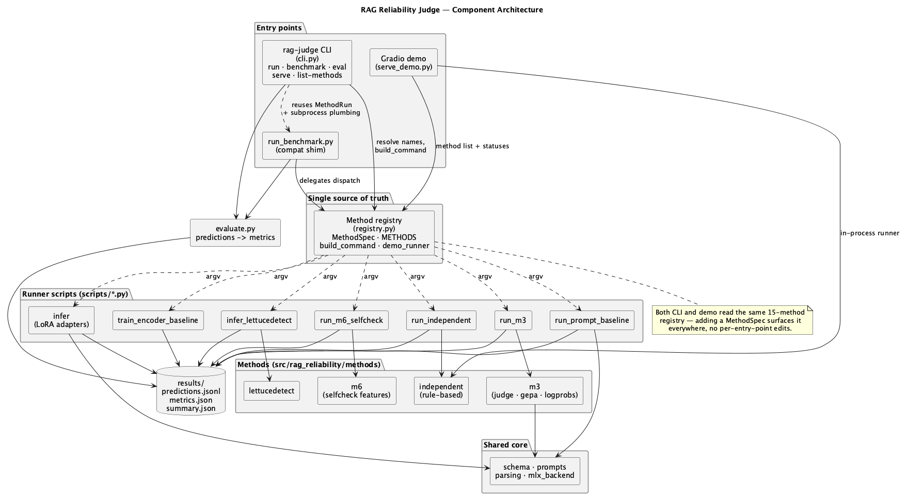
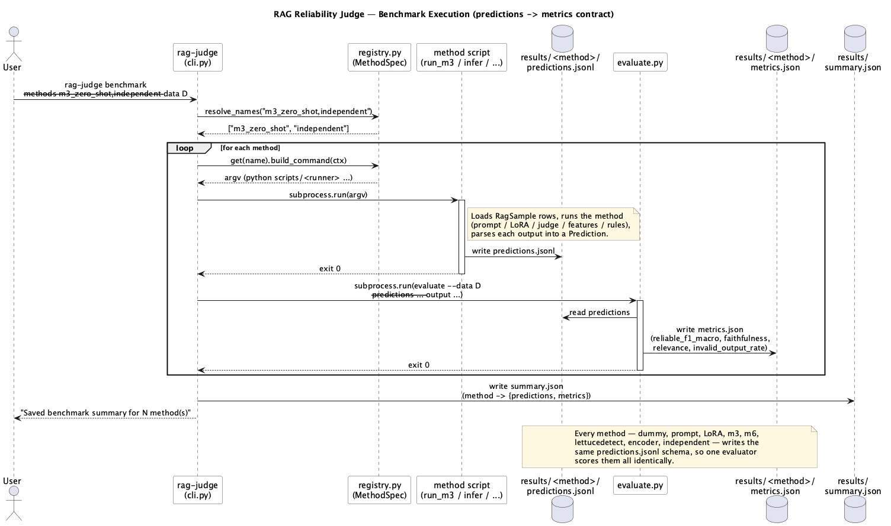
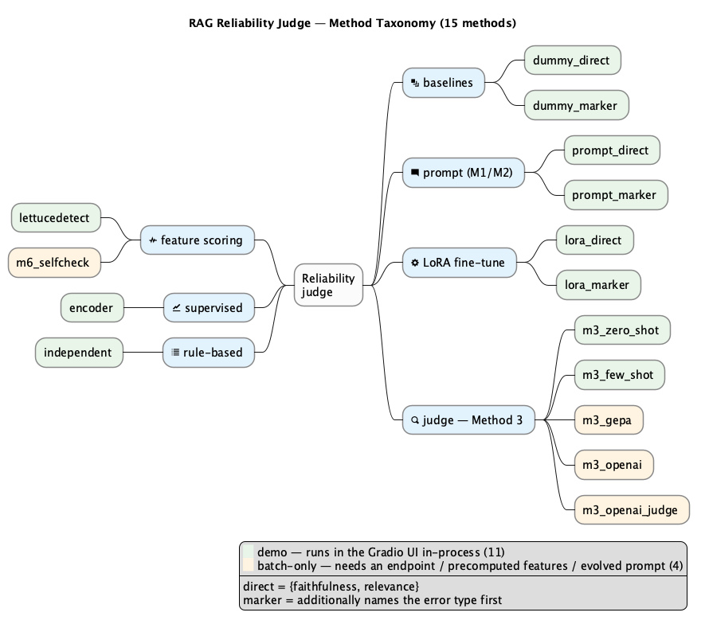
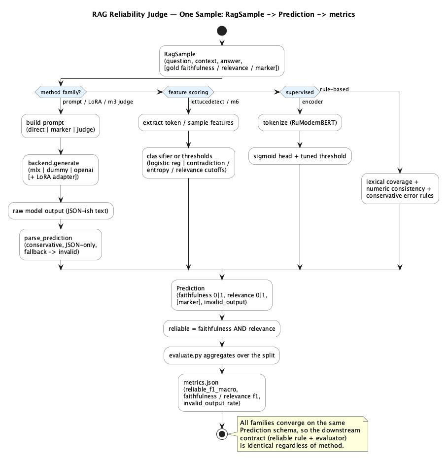

# Diagrams

PlantUML sources (`.puml`) with rendered PNGs. Regenerate after editing a
source:

```bash
plantuml -tpng docs/diagrams/*.puml
```

| Diagram | Source | What it shows |
|---|---|---|
| Component architecture | [architecture.puml](architecture.puml) | The method registry as the single source of truth; the `rag-judge` CLI, Gradio demo, and the `run_benchmark` shim all read from it; runner scripts and the shared evaluator. |
| Benchmark pipeline | [benchmark-pipeline.puml](benchmark-pipeline.puml) | Sequence of a `rag-judge benchmark` run: resolve methods → `build_command` → subprocess → `predictions.jsonl` → `evaluate.py` → `metrics.json` → `summary.json`. |
| Method taxonomy | [method-taxonomy.puml](method-taxonomy.puml) | The 15 methods grouped by family, marked demo (in-process UI) vs batch-only, with the direct/marker distinction. |
| Sample data flow | [sample-dataflow.puml](sample-dataflow.puml) | One `RagSample` through each method family, converging on the shared `Prediction` schema and the `reliable = faithfulness AND relevance` rule. |

## Rendered








